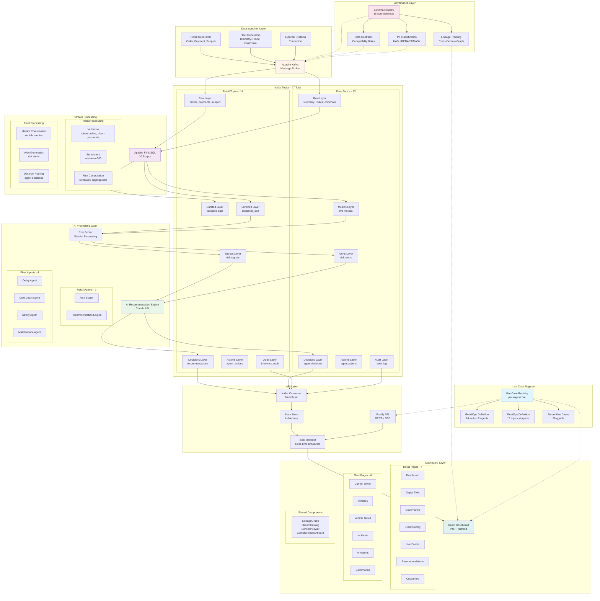
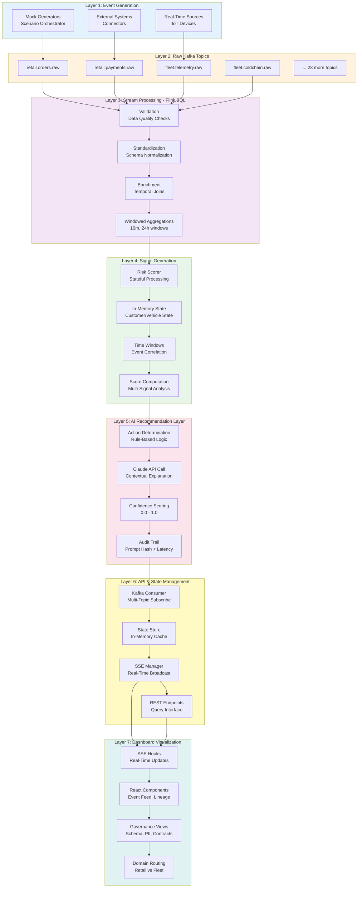
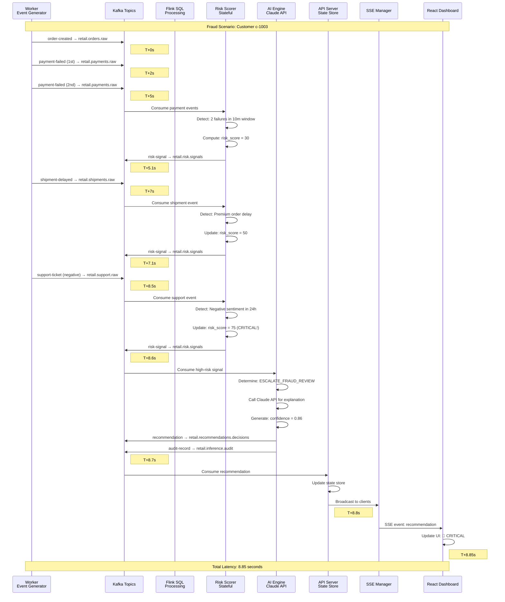
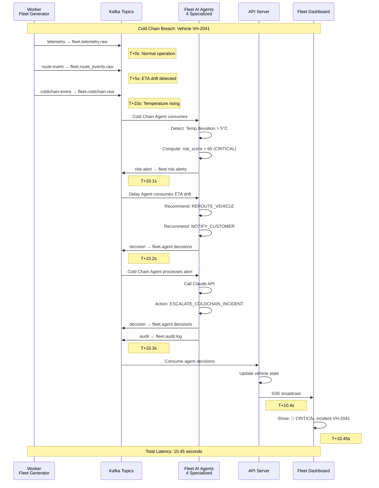
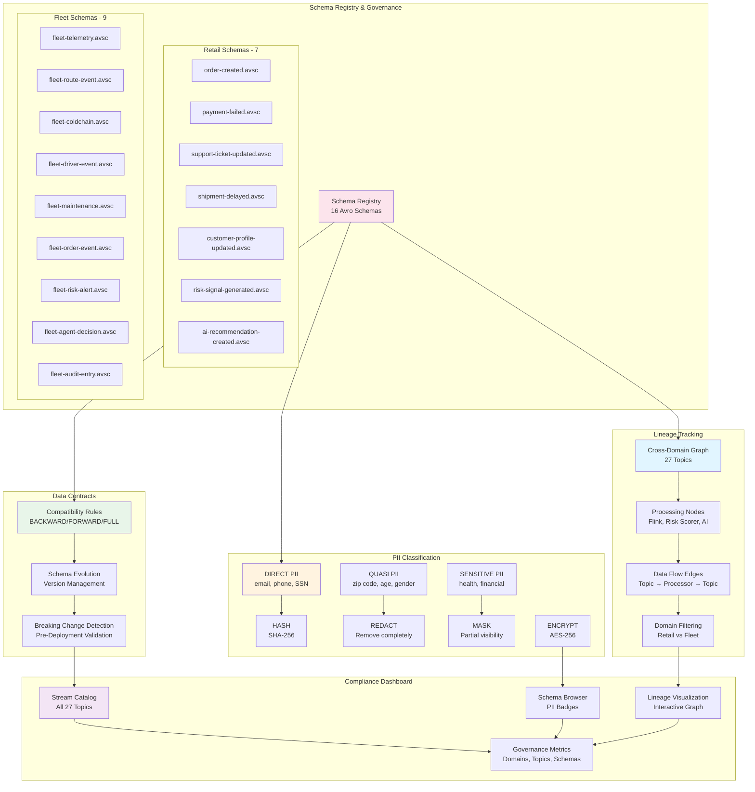
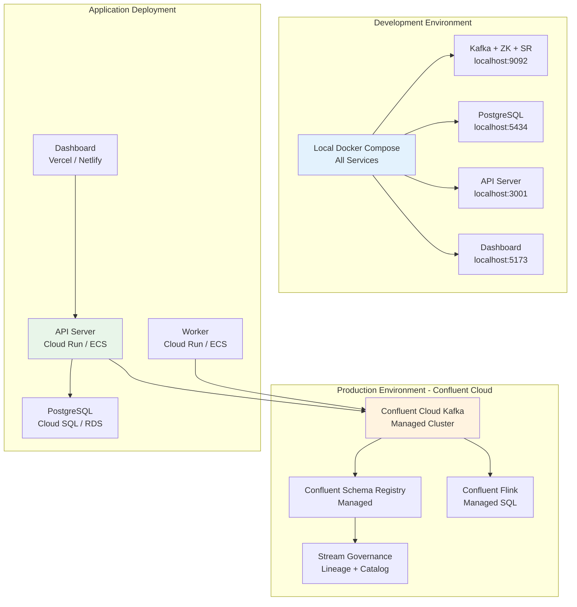

# CTO Platform: Complete Architecture Flow Diagram

## System Overview

## Seven-Layer Data Flow

## RetailOps Complete Flow

## FleetOps Complete Flow

## Governance Architecture

## Technology Stack & Infrastructure

```mermaid
graph LR
    subgraph "Frontend Stack"
        REACT[React 19<br/>UI Framework]
        VITE[Vite<br/>Build Tool]
        TAIL[Tailwind CSS v4<br/>Styling]
        SSE_FE[SSE Hooks<br/>Real-Time Updates]
    end
    
    subgraph "Backend Stack"
        NODE[Node.js 22+<br/>Runtime]
        FAST[Fastify 5<br/>API Framework]
        TS[TypeScript<br/>Language]
        KAFKA_JS[KafkaJS<br/>Client Library]
    end
    
    subgraph "AI Stack"
        CLAUDE[Claude Sonnet 4<br/>LLM]
        ANTHROPIC[Anthropic API<br/>SDK]
        PROMPT[Prompt Engineering<br/>Context Management]
    end
    
    subgraph "Streaming Stack"
        KAFKA_INFRA[Apache Kafka 7.9.0<br/>Message Broker]
        ZK[Zookeeper<br/>Coordination]
        SR_INFRA[Schema Registry 7.9.0<br/>Schema Management]
        FLINK_INFRA[Apache Flink SQL<br/>Stream Processing]
        CONNECT[Kafka Connect<br/>Connectors]
    end
    
    subgraph "Data Stack"
        PG[PostgreSQL 17<br/>Relational DB]
        MEM[In-Memory State<br/>State Store]
        AVRO[Avro Schemas<br/>Serialization]
    end
    
    subgraph "DevOps Stack"
        DOCKER[Docker<br/>Containerization]
        COMPOSE[Docker Compose<br/>Orchestration]
        NPM[npm Workspaces<br/>Monorepo]
    end
    
    REACT --> VITE
    VITE --> TAIL
    REACT --> SSE_FE
    
    NODE --> FAST
    FAST --> TS
    TS --> KAFKA_JS
    
    CLAUDE --> ANTHROPIC
    ANTHROPIC --> PROMPT
    
    KAFKA_INFRA --> ZK
    KAFKA_INFRA --> SR_INFRA
    KAFKA_INFRA --> FLINK_INFRA
    KAFKA_INFRA --> CONNECT
    
    PG --> MEM
    SR_INFRA --> AVRO
    
    DOCKER --> COMPOSE
    COMPOSE --> NPM
    
    SSE_FE -.-> FAST
    KAFKA_JS -.-> KAFKA_INFRA
    PROMPT -.-> FAST
    AVRO -.-> KAFKA_INFRA
    
    style REACT fill:#61dafb
    style NODE fill:#68a063
    style CLAUDE fill:#d97757
    style KAFKA_INFRA fill:#231f20
    style PG fill:#336791
    style DOCKER fill:#2496ed
```

## Performance & Latency Breakdown

```mermaid
gantt
    title End-to-End Latency: Event to Dashboard (Typical: 200-300ms)
    dateFormat X
    axisFormat %L ms
    
    section Event Flow
    Event Generation → Kafka Write           :0, 10
    Kafka Write → Consumer Read              :10, 60
    Consumer Read → Risk Scoring             :60, 80
    Risk Scoring → AI Recommendation         :80, 280
    AI Recommendation → API State Update     :280, 290
    API State Update → SSE Broadcast         :290, 295
    SSE Broadcast → Dashboard Update         :295, 300
```

## Deployment Architecture

## Key Metrics & Monitoring

```mermaid
graph TB
    subgraph "System Metrics"
        M1[Event Throughput<br/>Events/sec per topic]
        M2[Consumer Lag<br/>Messages behind]
        M3[Processing Latency<br/>End-to-end time]
        M4[Error Rate<br/>Failed messages]
    end
    
    subgraph "Business Metrics"
        B1[Risk Signals Generated<br/>Per domain]
        B2[AI Recommendations<br/>Per hour]
        B3[High-Risk Escalations<br/>Score > 60]
        B4[Agent Decisions<br/>Per agent type]
    end
    
    subgraph "Governance Metrics"
        G1[Schema Versions<br/>Active schemas]
        G2[PII Fields Tracked<br/>Classification count]
        G3[Data Contract Violations<br/>Compatibility errors]
        G4[Lineage Depth<br/>Processing hops]
    end
    
    subgraph "AI Metrics"
        A1[Claude API Latency<br/>Response time]
        A2[Confidence Scores<br/>Average per domain]
        A3[Prompt Token Usage<br/>Cost tracking]
        A4[Inference Audit Trail<br/>Complete records]
    end
    
    M1 --> DASH_METRICS[Metrics Dashboard]
    M2 --> DASH_METRICS
    M3 --> DASH_METRICS
    M4 --> DASH_METRICS
    
    B1 --> DASH_METRICS
    B2 --> DASH_METRICS
    B3 --> DASH_METRICS
    B4 --> DASH_METRICS
    
    G1 --> DASH_GOV[Governance Dashboard]
    G2 --> DASH_GOV
    G3 --> DASH_GOV
    G4 --> DASH_GOV
    
    A1 --> DASH_AI[AI Performance Dashboard]
    A2 --> DASH_AI
    A3 --> DASH_AI
    A4 --> DASH_AI
    
    style DASH_METRICS fill:#e8f5e9
    style DASH_GOV fill:#fce4ec
    style DASH_AI fill:#fff3e0
```

---

## Summary

This architecture demonstrates:

1. **Multi-Domain Support**: Pluggable use case registry pattern
2. **Real-Time Processing**: Sub-second latency through 7 layers
3. **Governed Data Flow**: Schema Registry, PII classification, lineage tracking
4. **AI-Enhanced Decisions**: Claude API integration with audit trails
5. **Scalable Architecture**: Kafka-centric event-driven design
6. **Developer Experience**: Monorepo structure with shared packages
7. **Production Ready**: Confluent Cloud deployment path

**Total Coverage**:
- 27 Kafka Topics (14 Retail + 13 Fleet)
- 16 Avro Schemas with PII classification
- 10 Flink SQL scripts for stream processing
- 6 AI Agents (2 Retail + 4 Fleet)
- 13 Dashboard pages across both domains
- Complete governance layer with lineage tracking