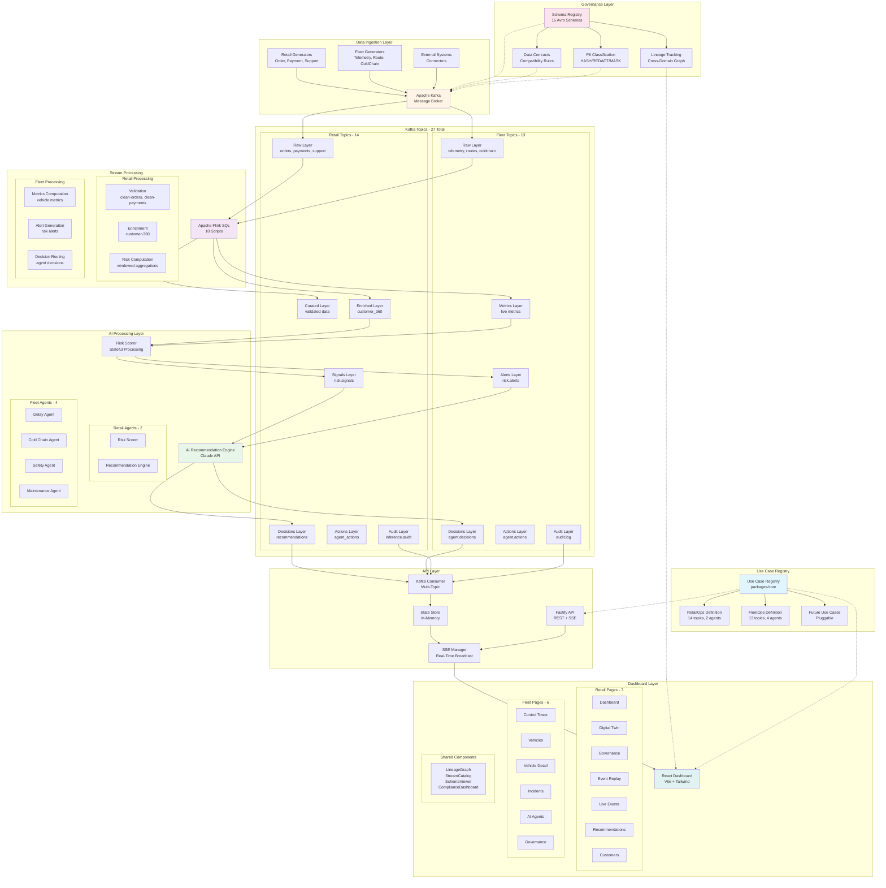
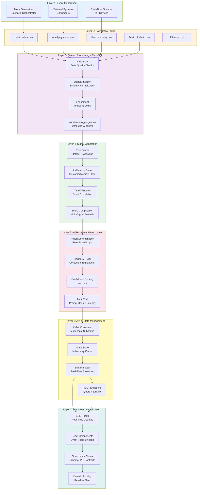

# CTO — Control Tower Orchestra

**"CTO is the control tower for the AI era."**

Every stream, every agent, and every decision passes through one trusted orchestration layer.

---

A real-time AI decision platform and governed orchestration engine built for the 2026 Confluent hackathon. CTO provides a reusable event-driven backbone where any enterprise use case — retail risk, fleet logistics, healthcare, energy, telecom, or future domains — plugs into a single governed orchestration layer powered by **Confluent Cloud**, **Apache Flink**, and **Stream Governance**.

## 🎯 Platform Overview

CTO is a **multi-domain control tower** that demonstrates how enterprises can build a unified streaming platform for diverse use cases while maintaining governance, lineage, and compliance across all domains.

### Shipped Use Cases

1. **RetailOps Control Tower** — E-commerce risk, fraud detection, and VIP retention
2. **FleetOps Control Tower** — Logistics operations with autonomous AI agents

### Additional Use Cases (Definitions Ready)

3. **FinGuard** — Financial fraud detection and AML compliance
4. **CareFlow** — Healthcare patient monitoring and care coordination
5. **GridWatch** — Energy grid monitoring and demand forecasting
6. **NetPulse** — Telecom network health and customer experience
7. **FactoryGuardian** — Manufacturing quality control and predictive maintenance

All use cases share the same **CTO Core Engine** for governance, lineage tracking, PII management, and schema evolution.

---

## 🏗️ Architecture

### System Overview



### Seven-Layer Data Flow



### Technology Stack

```mermaid
graph LR
    subgraph "Frontend Stack"
        REACT[React 19<br/>UI Framework]
        VITE[Vite<br/>Build Tool]
        TAIL[Tailwind CSS v4<br/>Styling]
        SSE_FE[SSE Hooks<br/>Real-Time Updates]
    end
    
    subgraph "Backend Stack"
        NODE[Node.js 22+<br/>Runtime]
        FAST[Fastify 5<br/>API Framework]
        TS[TypeScript<br/>Language]
        KAFKA_JS[KafkaJS<br/>Client Library]
    end
    
    subgraph "AI Stack"
        CLAUDE[Claude Sonnet 4<br/>LLM]
        ANTHROPIC[Anthropic API<br/>SDK]
        PROMPT[Prompt Engineering<br/>Context Management]
    end
    
    subgraph "Streaming Stack"
        KAFKA_INFRA[Apache Kafka 7.9.0<br/>Message Broker]
        ZK[Zookeeper<br/>Coordination]
        SR_INFRA[Schema Registry 7.9.0<br/>Schema Management]
        FLINK_INFRA[Apache Flink SQL<br/>Stream Processing]
        CONNECT[Kafka Connect<br/>Connectors]
    end
    
    subgraph "Data Stack"
        PG[PostgreSQL 17<br/>Relational DB]
        MEM[In-Memory State<br/>State Store]
        AVRO[Avro Schemas<br/>Serialization]
    end
    
    subgraph "DevOps Stack"
        DOCKER[Docker<br/>Containerization]
        COMPOSE[Docker Compose<br/>Orchestration]
        NPM[npm Workspaces<br/>Monorepo]
    end
    
    REACT --> VITE
    VITE --> TAIL
    REACT --> SSE_FE
    
    NODE --> FAST
    FAST --> TS
    TS --> KAFKA_JS
    
    CLAUDE --> ANTHROPIC
    ANTHROPIC --> PROMPT
    
    KAFKA_INFRA --> ZK
    KAFKA_INFRA --> SR_INFRA
    KAFKA_INFRA --> FLINK_INFRA
    KAFKA_INFRA --> CONNECT
    
    PG --> MEM
    SR_INFRA --> AVRO
    
    DOCKER --> COMPOSE
    COMPOSE --> NPM
    
    SSE_FE -.-> FAST
    KAFKA_JS -.-> KAFKA_INFRA
    PROMPT -.-> FAST
    AVRO -.-> KAFKA_INFRA
    
    style REACT fill:#61dafb
    style NODE fill:#68a063
    style CLAUDE fill:#d97757
    style KAFKA_INFRA fill:#231f20
    style PG fill:#336791
    style DOCKER fill:#2496ed
```



---

## 📦 Repository Structure

```
SignalTwinAI/
├── package.json                  # Root workspace config
├── tsconfig.base.json            # Shared TypeScript config
├── docker-compose.yml            # Local infrastructure (optional)
├── .env.example                  # Environment template
│
├── packages/
│   ├── core/                     # 🎯 CTO Core Engine
│   │   └── src/
│   │       ├── types.ts          # UseCaseDefinition, DomainTopics, GovernanceMetrics
│   │       ├── use-case-registry.ts  # Domain registration and lookup
│   │       ├── governance.ts     # Cross-domain lineage, PII report, data contracts
│   │       ├── generic-processor.ts  # Kafka consumer factory
│   │       ├── generic-state-store.ts # Domain-parameterized state store
│   │       └── definitions/
│   │           ├── retail.ts     # RetailOps: topics, scoring, lineage, schemas, PII
│   │           ├── fleet.ts      # FleetOps: topics, agents, lineage, schemas, PII
│   │           ├── finguard.ts   # Financial fraud detection
│   │           ├── careflow.ts   # Healthcare monitoring
│   │           ├── gridwatch.ts  # Energy grid management
│   │           ├── netpulse.ts   # Telecom network health
│   │           └── factory-guardian.ts # Manufacturing quality
│   │
│   ├── shared/                   # Shared types, constants, Kafka client
│   │   └── src/
│   │       ├── types.ts          # Event interfaces (all domains)
│   │       ├── constants.ts      # Topic names, risk weights, thresholds
│   │       └── kafka.ts          # KafkaJS client factory
│   │
│   ├── schemas/                  # Avro schemas for all event types
│   │   └── avro/                 # 16 .avsc schema files (7 retail + 9 fleet)
│   │
│   └── streaming/
│       └── flink-sql/            # Flink SQL scripts
│           ├── 01-create-source-tables.sql      # Retail source tables
│           ├── 02-clean-orders.sql              # Data cleansing
│           ├── 03-clean-payments.sql            # Payment validation
│           ├── 04-customer-360.sql              # Customer enrichment
│           ├── 05-risk-signals.sql              # Risk scoring
│           ├── 06-decisions.sql                 # Decision routing
│           ├── 10-fleet-source-tables.sql       # Fleet source tables
│           ├── 11-fleet-metrics.sql             # Fleet aggregations
│           ├── 12-fleet-risk-alerts.sql         # Fleet alerts
│           └── 13-fleet-agent-decisions.sql     # Agent decisions
│
├── apps/
│   ├── api/                      # Fastify 5 API server
│   │   └── src/
│   │       ├── index.ts          # Server entrypoint
│   │       ├── config.ts         # Configuration
│   │       ├── routes/           # REST + SSE endpoints
│   │       │   ├── health.ts     # Health check
│   │       │   ├── events.ts     # Event streaming (SSE)
│   │       │   ├── recommendations.ts # AI recommendations
│   │       │   ├── customers.ts  # Customer data
│   │       │   ├── actions.ts    # Operator actions
│   │       │   ├── governance.ts # Governance endpoints (11 routes)
│   │       │   ├── copilot.ts    # AI copilot chat
│   │       │   ├── replay.ts     # Event replay
│   │       │   └── fleet.ts      # Fleet operations
│   │       └── services/
│   │           ├── sse-manager.ts      # Server-Sent Events
│   │           ├── kafka-consumer.ts   # Kafka consumer
│   │           ├── kafka-producer.ts   # Kafka producer
│   │           └── state-store.ts      # In-memory state
│   │
│   ├── worker/                   # Background worker
│   │   └── src/
│   │       ├── index.ts          # Worker entrypoint
│   │       ├── config.ts         # Configuration
│   │       ├── generators/       # Mock event generators
│   │       │   ├── customer-generator.ts
│   │       │   ├── order-generator.ts
│   │       │   ├── payment-generator.ts
│   │       │   ├── support-generator.ts
│   │       │   ├── shipment-generator.ts
│   │       │   ├── scenario-orchestrator.ts
│   │       │   ├── fleet-telemetry-generator.ts
│   │       │   ├── fleet-driver-generator.ts
│   │       │   ├── fleet-route-generator.ts
│   │       │   ├── fleet-coldchain-generator.ts
│   │       │   ├── fleet-maintenance-generator.ts
│   │       │   └── fleet-scenario-orchestrator.ts
│   │       ├── processors/       # Stream processors
│   │       │   ├── risk-scorer.ts
│   │       │   ├── recommendation-engine.ts
│   │       │   ├── fleet-delay-agent.ts
│   │       │   ├── fleet-coldchain-agent.ts
│   │       │   ├── fleet-safety-agent.ts
│   │       │   └── fleet-maintenance-agent.ts
│   │       └── services/
│   │           ├── kafka-producer.ts
│   │           ├── claude-client.ts
│   │           └── watsonx-client.ts
│   │
│   └── dashboard/                # React 19 dashboard
│       └── src/
│           ├── App.tsx           # Main app with routing
│           ├── main.tsx          # Entry point
│           ├── app.css           # Tailwind CSS v4
│           ├── pages/            # All dashboard pages
│           │   ├── CaseSelectorPage.tsx        # Use case selector
│           │   ├── DashboardPage.tsx           # Main dashboard
│           │   ├── CustomerDetailPage.tsx      # Customer details
│           │   ├── DigitalTwinPage.tsx         # Digital twin view
│           │   ├── GovernancePage.tsx          # Governance dashboard
│           │   ├── ReplayPage.tsx              # Event replay
│           │   └── fleet/
│           │       ├── FleetDashboardPage.tsx  # Fleet control tower
│           │       ├── FleetVehiclesPage.tsx   # Vehicle list
│           │       ├── FleetVehicleDetailPage.tsx # Vehicle details
│           │       ├── FleetIncidentsPage.tsx  # Incidents
│           │       └── FleetAgentsPage.tsx     # AI agents
│           ├── components/       # Reusable components
│           │   ├── LineageGraph.tsx
│           │   ├── StreamCatalog.tsx
│           │   ├── ComplianceDashboard.tsx
│           │   ├── SchemaViewer.tsx
│           │   ├── EventFeed.tsx
│           │   ├── CopilotPanel.tsx
│           │   ├── ReplayPanel.tsx
│           │   ├── RiskGauge.tsx
│           │   ├── RecommendationCard.tsx
│           │   └── ActionButtons.tsx
│           ├── hooks/
│           │   ├── useSSE.ts     # Server-Sent Events hook
│           │   └── useRecommendations.ts
│           └── api/
│               └── client.ts     # API client
│
└── infra/
    ├── docker/                   # Dockerfiles
    │   ├── api.Dockerfile
    │   ├── worker.Dockerfile
    │   └── dashboard.Dockerfile
    ├── confluent/                # Confluent Cloud setup
    │   ├── create-topics-kafka.js        # Topic creation via KafkaJS
    │   ├── create-topics-api.js          # Topic creation via REST API
    │   ├── register-schemas.sh           # Schema registration
    │   ├── set-data-contracts.sh         # Data contracts
    │   ├── verify-setup.js               # Verification script
    │   ├── prepare-flink-sql.sh          # SQL file preparation
    │   ├── SIMPLE_EXECUTION_GUIDE.md     # Quick start guide
    │   ├── FLINK_EXECUTION_GUIDE.md      # Detailed Flink guide
    │   └── DEPLOYMENT_CHECKLIST.md       # Deployment checklist
    └── sql/
        └── init.sql              # PostgreSQL seed data (optional)
```

---

## 🚀 Quick Start

### Prerequisites

- **Node.js** >= 22.x
- **npm** >= 10.x
- **Confluent Cloud Account** (free trial available)
- **Anthropic API Key** (for AI recommendations)
- **IBM WatsonX API Key** (optional, for enhanced AI)

### 1. Clone and Install

```bash
git clone <repo-url>
cd SignalTwinAI
npm run setup
```

This runs `npm install` and builds `packages/core`, `packages/shared`, and `packages/schemas`.

### 2. Configure Environment

```bash
cp .env.example .env
```

Edit `.env` and set your credentials:

```env
# Confluent Cloud
KAFKA_BOOTSTRAP_SERVERS=pkc-xxxxx.us-east-1.aws.confluent.cloud:9092
KAFKA_API_KEY=your-api-key
KAFKA_API_SECRET=your-api-secret
SCHEMA_REGISTRY_URL=https://psrc-xxxxx.us-east-1.aws.confluent.cloud
SCHEMA_REGISTRY_API_KEY=your-sr-key
SCHEMA_REGISTRY_API_SECRET=your-sr-secret

# AI Services
ANTHROPIC_API_KEY=sk-ant-your-key-here
WATSONX_API_KEY=your-watsonx-key (optional)
WATSONX_PROJECT_ID=your-project-id (optional)

# Application
NODE_ENV=development
API_PORT=3001
```

### 3. Set Up Confluent Cloud

#### Option A: Automated Setup (Recommended)

```bash
# Create topics (27 topics: 14 retail + 13 fleet)
npm run infra:topics

# Register schemas (16 Avro schemas)
npm run infra:schemas

# Set data contracts (schema compatibility)
npm run infra:contracts
```

#### Option B: Manual Setup

Follow the guide: `infra/confluent/SIMPLE_EXECUTION_GUIDE.md`

### 4. Deploy Flink SQL Jobs

1. Go to Confluent Cloud → Flink → SQL Workspace
2. Select your compute pool
3. Execute SQL files from `packages/streaming/flink-sql/prepared/` in order:
   - `01-create-source-tables.sql` (5 tables)
   - `02-clean-orders.sql` (cleansing)
   - `03-clean-payments.sql` (validation)
   - `04-customer-360.sql` (enrichment)
   - `05-risk-signals.sql` (scoring)
   - `06-decisions.sql` (routing)
   - `10-fleet-source-tables.sql` (5 fleet tables)
   - `11-fleet-metrics.sql` (aggregations)
   - `12-fleet-risk-alerts.sql` (alerts)
   - `13-fleet-agent-decisions.sql` (decisions)

See detailed guide: `infra/confluent/FLINK_EXECUTION_GUIDE.md`

### 5. Start Application Services

```bash
npm run dev
```

| Service | URL | Description |
|---------|-----|-------------|
| API | http://localhost:3001 | Fastify REST API + SSE streams |
| Dashboard | http://localhost:5173 | React dashboard |
| Worker | (background) | Event generators + AI agents |

Open http://localhost:5173 to see the CTO hub with use case selector.

---

## 🎯 Use Cases

### 1. RetailOps Control Tower

**E-commerce risk, fraud detection, and VIP retention with real-time customer signal correlation.**

#### Topics (14)

**Raw Layer:**
- `retail.orders.raw` — Order events
- `retail.payments.raw` — Payment transactions
- `retail.support.raw` — Support tickets
- `retail.shipments.raw` — Shipment tracking
- `retail.customers.raw` — Customer profiles

**Curated Layer:**
- `retail.orders.clean` — Validated orders
- `retail.payments.clean` — Validated payments
- `retail.support.clean` — Categorized support
- `retail.shipments.clean` — Enriched shipments

**Enriched Layer:**
- `retail.customer_360.enriched` — Customer 360 view

**Signals Layer:**
- `retail.risk.signals` — Risk scores

**Decisions Layer:**
- `retail.recommendations.decisions` — AI recommendations

**Actions Layer:**
- `retail.agent_actions.actions` — Operator actions

**Audit Layer:**
- `retail.inference.audit` — Audit trail

#### Risk Scoring

| Condition | Score | Signal |
|-----------|-------|--------|
| 2+ payment failures in 10 minutes | +30 | Potential fraud |
| Shipment delayed for premium order | +20 | Churn risk |
| Negative support event in 24 hours | +25 | Customer dissatisfaction |
| Refund request after shipment issue | +15 | Service recovery needed |
| VIP customer | +10 | High-value retention priority |
| **Total > 60** | — | **Escalate to human review** |

#### AI Agents (2)

1. **Risk Scorer** — Real-time risk calculation based on multi-signal correlation
2. **AI Recommendation Engine** — Claude-powered recommendations with PII redaction

#### Dashboard Pages (7)

- Dashboard — Overview with key metrics
- Digital Twin — Real-time customer state
- Governance — Schema registry, lineage, PII
- Event Replay — Historical event playback
- Live Events — Real-time event stream
- Recommendations — AI-generated actions
- Customers — Customer list and details

#### Schemas (7)

- `order-created.avsc` — Order events
- `payment-failed.avsc` — Payment failures
- `support-ticket-updated.avsc` — Support tickets
- `shipment-delayed.avsc` — Shipment delays
- `customer-profile-updated.avsc` — Customer profiles
- `risk-signal-generated.avsc` — Risk signals
- `ai-recommendation-created.avsc` — AI recommendations

---

### 2. FleetOps Control Tower

**Real-time logistics control tower with vehicle telemetry, cold-chain monitoring, and autonomous AI agents.**

#### Overview

FleetOps is a comprehensive logistics operations platform that monitors vehicle fleets in real-time, detects anomalies, and provides autonomous AI-driven recommendations for route optimization, safety, maintenance, and cold-chain compliance.

#### Topics (13)

**Raw Layer:**
- `fleet.telemetry.raw` — Vehicle telemetry (speed, fuel, engine temp, GPS)
- `fleet.location_updates.raw` — GPS location updates
- `fleet.driver_events.raw` — Driver behavior (harsh braking, speeding, fatigue)
- `fleet.order_events.raw` — Delivery order status
- `fleet.route_events.raw` — Route planning and ETA updates
- `fleet.coldchain.raw` — Refrigeration telemetry (temp, humidity, door status)
- `fleet.maintenance.raw` — Vehicle health and fault codes
- `fleet.support_events.raw` — Driver support requests

**Signals Layer:**
- `fleet.metrics.live` — Real-time fleet metrics (aggregated)
- `fleet.risk.alerts` — Risk alerts (safety, cold-chain, maintenance)

**Decisions Layer:**
- `fleet.agent.decisions` — AI agent recommendations

**Actions Layer:**
- `fleet.agent.actions` — Operator/automated actions

**Audit Layer:**
- `fleet.audit.log` — Complete audit trail

#### AI Agents (4)

##### 1. Delay Agent

**Purpose:** Monitors ETA drift and traffic anomalies

**Input Topics:**
- `fleet.route_events.raw` — Route and ETA data
- `fleet.telemetry.raw` — Vehicle speed and location

**Detects:**
- ETA drift > 10 minutes (warning)
- ETA drift > 20 minutes (critical)
- Traffic anomalies
- Route deviations

**Recommendations:**
- Reroute via alternate path
- Notify customer of delay
- Escalate to dispatcher
- Adjust delivery schedule

**Example Decision:**
```json
{
  "agent_type": "delay_agent",
  "vehicle_id": "VEH-001",
  "severity": "CRITICAL",
  "recommendation": "REROUTE",
  "reason": "ETA drift 25 minutes due to traffic",
  "confidence": 0.92,
  "suggested_action": "Take Highway 101 alternate route"
}
```

##### 2. Cold Chain Agent

**Purpose:** Monitors refrigeration and ensures temperature compliance

**Input Topics:**
- `fleet.coldchain.raw` — Temperature, humidity, door events

**Detects:**
- Temperature deviation > 2°C (warning)
- Temperature deviation > 5°C (critical)
- Door open > 5 minutes
- Compressor failures
- Humidity violations

**Recommendations:**
- Priority delivery (deliver before spoilage)
- Reject shipment (temperature breach)
- Service refrigeration unit
- Notify quality control

**Example Decision:**
```json
{
  "agent_type": "coldchain_agent",
  "vehicle_id": "VEH-002",
  "severity": "CRITICAL",
  "recommendation": "PRIORITY_DELIVERY",
  "reason": "Temperature 8°C above target for 12 minutes",
  "confidence": 0.95,
  "suggested_action": "Deliver within 30 minutes or reject shipment"
}
```

##### 3. Safety Agent

**Purpose:** Detects unsafe driving behavior and fatigue

**Input Topics:**
- `fleet.driver_events.raw` — Driving behavior
- `fleet.telemetry.raw` — Speed, acceleration

**Detects:**
- Harsh braking (> 0.5g deceleration)
- Speeding (> 110 km/h)
- Rapid acceleration
- Fatigue indicators (driving time > 8 hours)
- Safety score < 70 (warning)
- Safety score < 50 (critical)

**Recommendations:**
- Driver coaching
- Mandatory rest break
- Speed governor activation
- Escalate to safety manager
- Suspend driver (severe violations)

**Example Decision:**
```json
{
  "agent_type": "safety_agent",
  "vehicle_id": "VEH-003",
  "driver_id": "DRV-123",
  "severity": "HIGH",
  "recommendation": "MANDATORY_REST",
  "reason": "3 harsh braking events + driving 9 hours",
  "confidence": 0.88,
  "suggested_action": "Require 30-minute rest break"
}
```

##### 4. Maintenance Agent

**Purpose:** Predicts vehicle failures and schedules maintenance

**Input Topics:**
- `fleet.maintenance.raw` — Fault codes, diagnostics
- `fleet.telemetry.raw` — Engine health, mileage

**Detects:**
- Engine temperature > 100°C (warning)
- Engine temperature > 110°C (critical)
- Fault codes (check engine, ABS, transmission)
- Oil pressure low
- Brake wear indicators
- Maintenance risk score > 40 (warning)
- Maintenance risk score > 70 (critical)

**Recommendations:**
- Schedule preventive maintenance
- Immediate service required
- Vehicle swap (critical failure)
- Order replacement parts
- Reduce load/speed

**Example Decision:**
```json
{
  "agent_type": "maintenance_agent",
  "vehicle_id": "VEH-004",
  "severity": "CRITICAL",
  "recommendation": "VEHICLE_SWAP",
  "reason": "Engine temp 115°C + transmission fault code",
  "confidence": 0.91,
  "suggested_action": "Swap vehicle at next depot, schedule immediate service"
}
```

#### Risk Thresholds

| Metric | Warning | Critical |
|--------|---------|----------|
| ETA Drift | 10 minutes | 20 minutes |
| Cold Chain Temp Deviation | 2°C | 5°C |
| Safety Score | < 70 | < 50 |
| Maintenance Risk | > 40 | > 70 |
| Harsh Braking | 0.5g | 0.8g |
| Overspeed | 110 km/h | 130 km/h |
| Engine Temperature | 100°C | 110°C |

#### Dashboard Pages (6)

1. **Control Tower** — Real-time fleet overview
   - Active vehicles map
   - Fleet-wide metrics (on-time %, safety score, cold-chain compliance)
   - Critical alerts feed
   - Agent decision summary

2. **Vehicles** — Vehicle list and status
   - Filterable vehicle grid
   - Status indicators (active, idle, maintenance, critical)
   - Quick stats per vehicle
   - Search and sort

3. **Vehicle Detail** — Individual vehicle deep-dive
   - Real-time telemetry dashboard
   - Route map with ETA
   - Cold-chain temperature graph
   - Driver behavior timeline
   - Maintenance history
   - AI agent recommendations

4. **Incidents** — Alert and incident management
   - Active incidents list
   - Incident timeline
   - Severity filtering
   - Resolution tracking
   - Root cause analysis

5. **AI Agents** — Agent performance dashboard
   - Agent decision history
   - Recommendation acceptance rate
   - Confidence score distribution
   - Agent effectiveness metrics
   - Manual override tracking

6. **Governance** — Fleet-specific governance
   - Schema registry (9 schemas)
   - Data lineage graph
   - PII field inventory (vehicle IDs, GPS coordinates)
   - Data contracts and compatibility

#### Schemas (9)

- `fleet-telemetry.avsc` — Vehicle telemetry
- `fleet-driver-event.avsc` — Driver behavior
- `fleet-route-event.avsc` — Route and ETA
- `fleet-coldchain.avsc` — Refrigeration data
- `fleet-maintenance.avsc` — Vehicle health
- `fleet-audit-entry.avsc` — Audit trail
- `fleet-agent-decision.avsc` — AI decisions
- `location-update.avsc` — GPS updates
- `fleet-order-event.avsc` — Delivery orders

#### Data Flow

```
Vehicle Sensors → Telemetry Events → Kafka Topics → Flink Enrichment →
Risk Alerts → AI Agents → Decisions → Operator Actions → Audit Log
```

**Example Flow:**

1. **Vehicle VEH-001** sends telemetry: `speed=85 km/h, engine_temp=105°C, fuel=45%`
2. **Flink** aggregates metrics over 5-minute windows
3. **Flink** detects: `engine_temp > 100°C` → generates risk alert
4. **Maintenance Agent** consumes alert → analyzes historical data
5. **Agent** recommends: `REDUCE_SPEED` with confidence 0.87
6. **Operator** reviews recommendation → approves action
7. **System** sends command to vehicle → logs to audit trail

#### PII and Compliance

**PII Fields:**
- `vehicle_id` — Quasi-identifier (masked)
- `driver_id` — Quasi-identifier (masked)
- `lat`, `lng` — Sensitive location data (redacted in AI prompts)
- `customer_name_hash` — Direct identifier (hashed)

**Data Contracts:**
- All schemas use **BACKWARD** compatibility (safe field additions)
- Cold-chain schema uses **FULL** compatibility (critical for compliance)
- Agent decision schema uses **FULL** compatibility (audit requirements)

#### Integration Points

**External Systems:**
- **Fleet Management System** — Vehicle registration, driver assignments
- **Route Planning API** — Traffic data, alternate routes
- **Maintenance System** — Service scheduling, parts inventory
- **Customer Notification** — SMS/email for delivery updates
- **Telematics Provider** — Real-time vehicle data feed

**APIs:**
- `GET /api/fleet/vehicles` — List all vehicles
- `GET /api/fleet/vehicles/:id` — Vehicle details
- `GET /api/fleet/incidents` — Active incidents
- `GET /api/fleet/agents` — AI agent status
- `POST /api/fleet/actions` — Execute operator action
- `GET /api/fleet/metrics` — Fleet-wide metrics

---

### 3. FinGuard (Definition Ready)

**Financial fraud detection and AML compliance.**

- 12 topics (transactions, accounts, alerts, compliance)
- 3 AI agents (fraud detector, AML monitor, risk assessor)
- 8 schemas

### 4. CareFlow (Definition Ready)

**Healthcare patient monitoring and care coordination.**

- 15 topics (vitals, medications, appointments, alerts)
- 5 AI agents (vitals monitor, medication checker, care coordinator, emergency detector, readmission predictor)
- 10 schemas

### 5. GridWatch (Definition Ready)

**Energy grid monitoring and demand forecasting.**

- 11 topics (meter readings, grid events, outages, forecasts)
- 3 AI agents (demand forecaster, outage predictor, load balancer)
- 7 schemas

### 6. NetPulse (Definition Ready)

**Telecom network health and customer experience.**

- 14 topics (network events, customer complaints, service quality)
- 4 AI agents (network optimizer, churn predictor, QoS monitor, incident resolver)
- 9 schemas

### 7. FactoryGuardian (Definition Ready)

**Manufacturing quality control and predictive maintenance.**

- 13 topics (sensor data, quality metrics, maintenance, production)
- 4 AI agents (quality inspector, maintenance predictor, production optimizer, safety monitor)
- 8 schemas

---

## 🎛️ CTO Core Engine

The core engine (`packages/core`) provides a **Use Case Registry** — a simple data structure where each domain registers its complete definition:

```typescript
interface UseCaseDefinition {
  domain: string;              // 'retail' | 'fleet' | 'finguard' | ...
  displayName: string;         // 'RetailOps Control Tower'
  description: string;         // Use case description
  entityIdField: string;       // 'customer_id' | 'vehicle_id' | ...
  accentColor: string;         // UI theme color
  icon: string;                // UI icon
  topics: DomainTopics;        // raw, curated, enriched, signals, decisions, actions, audit
  scoring: ScoringConfig;      // input topics, weights, escalation threshold
  agents: AgentConfig[];       // AI agent definitions
  lineage: LineageDefinition;  // nodes + edges for governance graph
  schemas: SchemaMapping[];    // schema-to-topic with compatibility levels
  piiFields: PIIFieldMapping[];// field-level PII classification + handling
}
```

Adding a new use case requires **one definition file**. The governance layer, API routes, and dashboard automatically discover and display all registered domains.

### Governance Functions

The core engine generates governance data from the registry:

- `getCrossdomainLineage()` — Merged lineage graph across all domains
- `getLineageForDomain(domain)` — Domain-specific lineage
- `getPIIReport()` — PII field inventory across all schemas
- `getDataContracts()` — Compatibility rules per topic
- `getGovernanceMetrics()` — Counts: domains, topics, schemas, PII fields

---

## 🛡️ Governance Dashboard

The governance page is the demo centerpiece — a unified view across all domains with 4 sections:

### 1. Stream Catalog

All 27+ topics across all domains, filterable by:
- Domain (retail, fleet, finguard, etc.)
- Layer (raw, curated, enriched, signals, decisions, actions, audit)
- Search by topic name

### 2. Data Lineage

Cross-domain lineage graph with:
- Domain-colored nodes
- Hover highlighting
- Domain filter
- Processor labels on edges
- Interactive zoom and pan

### 3. Schema Registry

Schema browser with:
- PII classification badges (DIRECT, QUASI, SENSITIVE)
- Handling tags (HASH, MASK, REDACT, ENCRYPT)
- Compatibility levels (BACKWARD, FORWARD, FULL, NONE)
- Schema version history
- Field-level documentation

### 4. Compliance

Governance metrics overview:
- Total domains, topics, schemas
- PII field inventory
- Data contract compatibility rules
- Schema evolution tracking
- Audit trail statistics

---

## 🔌 API Endpoints

### Health & Metrics
- `GET /health` — Health check

### Events & Streaming
- `GET /events/stream` — SSE stream of all events
- `GET /events/domain/:domain` — Domain-filtered event stream

### Recommendations
- `GET /recommendations` — All AI recommendations
- `GET /recommendations/:customerId` — Customer-specific recommendations

### Customers (Retail)
- `GET /customers` — Customer list
- `GET /customers/:id` — Customer details

### Fleet Operations
- `GET /fleet/vehicles` — Vehicle list
- `GET /fleet/vehicles/:id` — Vehicle details
- `GET /fleet/incidents` — Active incidents
- `GET /fleet/agents` — AI agent status
- `POST /fleet/actions` — Execute operator action

### Actions
- `POST /actions` — Execute operator action

### Governance (11 endpoints)
- `GET /governance/metrics` — Governance metrics
- `GET /governance/lineage` — Cross-domain lineage
- `GET /governance/lineage/:domain` — Domain lineage
- `GET /governance/pii` — PII report
- `GET /governance/contracts` — Data contracts
- `GET /governance/catalog` — Stream catalog
- `GET /governance/catalog/:domain` — Domain catalog
- `GET /governance/schemas` — All schemas
- `GET /governance/schemas/:domain` — Domain schemas
- `GET /governance/audit` — Audit trail
- `GET /governance/compliance` — Compliance report

### Copilot
- `POST /copilot/chat` — AI copilot chat

### Replay
- `POST /replay/start` — Start event replay
- `POST /replay/stop` — Stop event replay
- `GET /replay/status` — Replay status

---

## 🧪 Testing

### Run Tests

```bash
npm test
```

### Manual Testing

1. **Start services**: `npm run dev`
2. **Open dashboard**: http://localhost:5173
3. **Select use case**: RetailOps or FleetOps
4. **Watch live events**: Events stream in real-time
5. **Check governance**: View lineage, schemas, PII
6. **Test AI agents**: See recommendations appear
7. **Execute actions**: Approve/reject recommendations

---

## 📊 Monitoring

### Confluent Cloud

- **Topics**: Monitor partition count, replication, retention
- **Flink Jobs**: Check job status, backpressure, checkpoints
- **Schema Registry**: Track schema versions, compatibility
- **Metrics**: Throughput, latency, consumer lag

### Application Metrics

- **API**: Request rate, response time, error rate
- **Worker**: Event processing rate, AI latency
- **Dashboard**: Active connections, SSE streams

---

## 🚢 Deployment

### Docker Compose (Local)

```bash
docker compose up -d
```

### Kubernetes (Production)

See `infra/k8s/` for Kubernetes manifests (coming soon).

### Confluent Cloud (Recommended)

1. Create Kafka cluster
2. Create Flink compute pool
3. Deploy Flink SQL jobs
4. Deploy application services (API, Worker, Dashboard)

---

## 📚 Documentation

- **Architecture**: `ARCHITECTURE_FLOW_DIAGRAM.md`
- **Confluent Setup**: `CONFLUENT_SETUP.md`
- **Data Flow**: `DATA_FLOW_GUIDE.md`
- **Flink Execution**: `infra/confluent/FLINK_EXECUTION_GUIDE.md`
- **Simple Guide**: `infra/confluent/SIMPLE_EXECUTION_GUIDE.md`
- **Deployment Checklist**: `infra/confluent/DEPLOYMENT_CHECKLIST.md`
- **WatsonX Integration**: `WATSONX.md`
- **Claude Integration**: `CLAUDE.md`

---

## 🤝 Contributing

Contributions welcome! Please read `CONTRIBUTING.md` for guidelines.

---

## 📄 License

MIT License - see `LICENSE` file for details.

---

## 🙏 Acknowledgments

Built for the **2026 Confluent Hackathon** using:
- Confluent Cloud (Kafka + Flink + Schema Registry)
- Anthropic Claude API
- IBM WatsonX
- React 19 + Vite + Tailwind CSS v4
- Node.js 22 + Fastify 5

---

## 📞 Support

For questions or issues:
- Open a GitHub issue
- Contact: [your-email]
- Slack: [your-slack-channel]

---

**CTO — Control Tower Orchestra**  
*The control tower for the AI era.*
