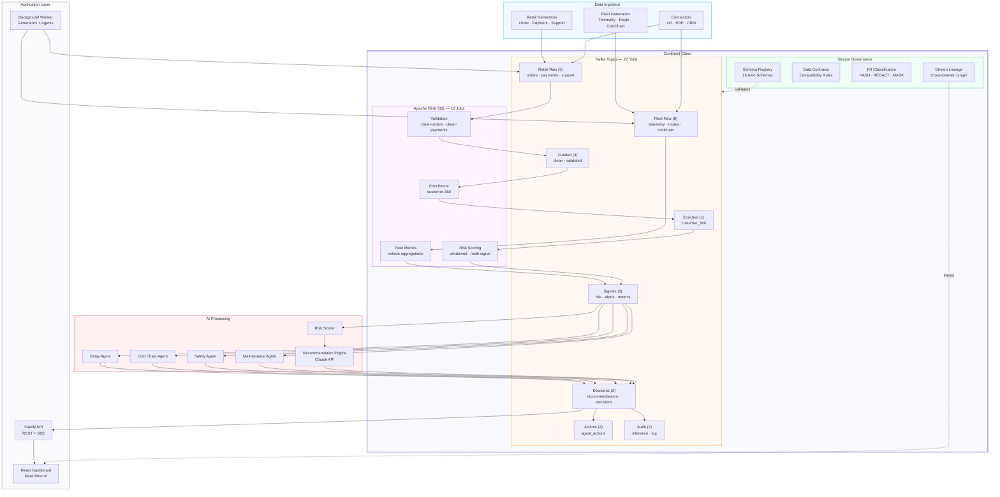
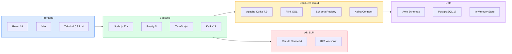
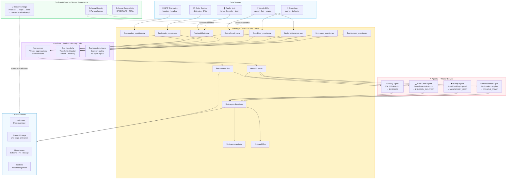
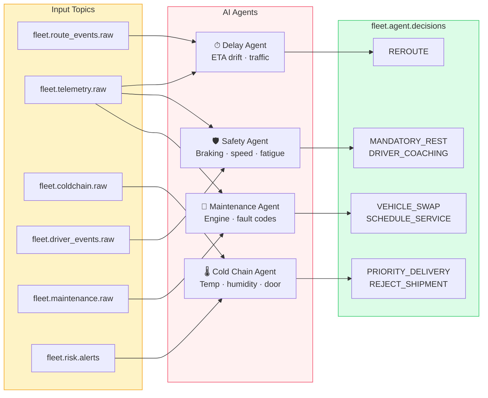
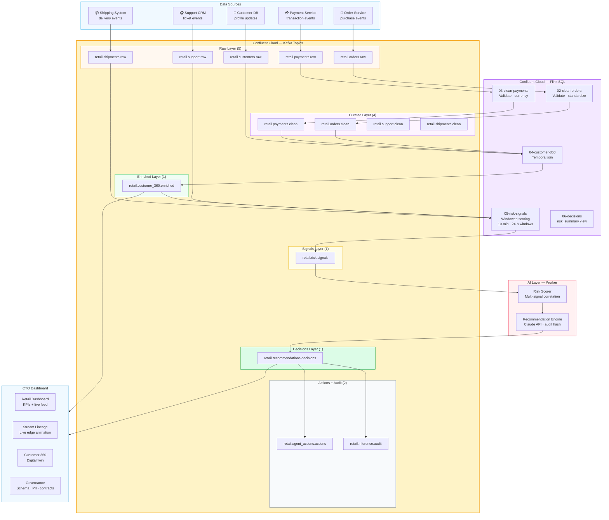
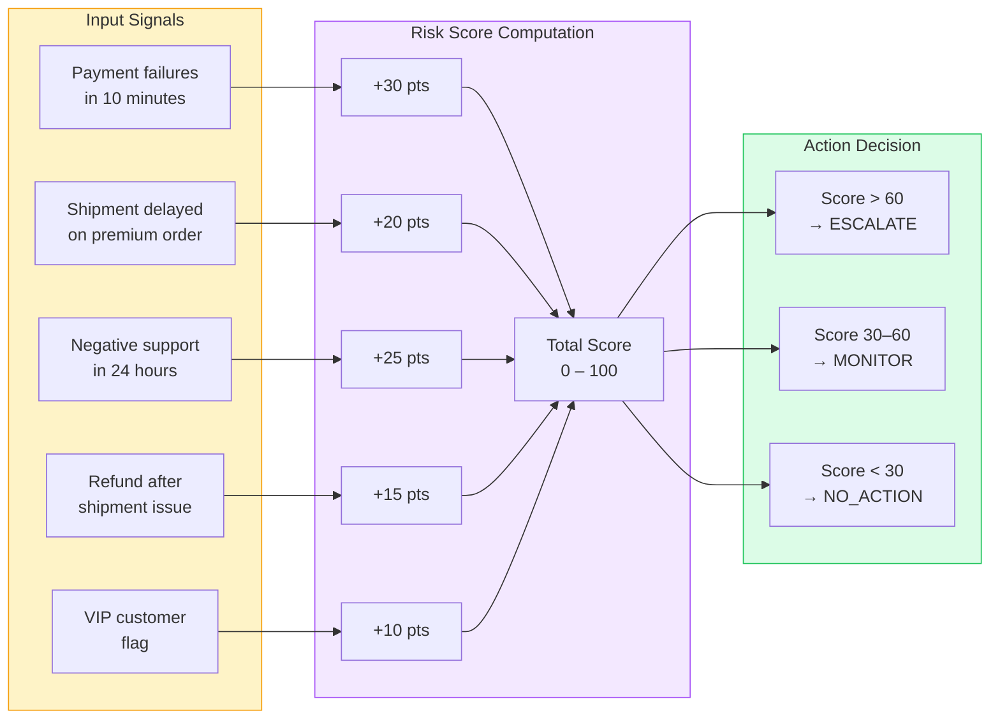
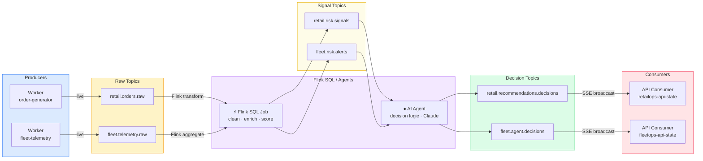
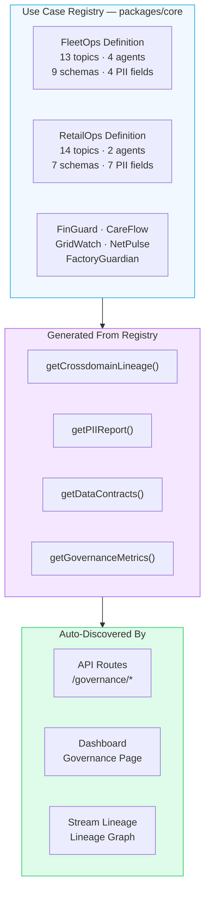

# CTO — Control Tower Orchestra

> **"The control tower for the AI era."**  
> Every stream, every agent, and every decision passes through one trusted orchestration layer.

A real-time AI decision platform built for the **2026 Confluent Hackathon**. CTO provides a reusable event-driven backbone where any enterprise use case — fleet logistics, retail risk, healthcare, energy, telecom, or future domains — plugs into a single governed orchestration layer powered by **Confluent Cloud**, **Apache Flink SQL**, and **Stream Governance**.

---

## 🎥 Demo

[](https://www.youtube.com/watch?v=pMSdUciQNas)

▶️ **[Watch the full demo on YouTube](https://www.youtube.com/watch?v=pMSdUciQNas)**

---

## Platform Overview

CTO is a **multi-domain control tower** that demonstrates how enterprises build a unified streaming platform for diverse use cases while maintaining governance, lineage, and compliance across all domains.

### Shipped Use Cases

| # | Use Case | Domain | Topics | AI Agents |
|---|----------|--------|--------|-----------|
| 1 | **FleetOps Control Tower** | Logistics & last-mile | 13 | 4 |
| 2 | **RetailOps Control Tower** | E-commerce risk & fraud | 14 | 2 |

### Additional Use Cases (Definitions Ready)

| # | Use Case | Domain |
|---|----------|--------|
| 3 | **FinGuard** | Financial fraud detection & AML |
| 4 | **CareFlow** | Healthcare patient monitoring |
| 5 | **GridWatch** | Energy grid monitoring |
| 6 | **NetPulse** | Telecom network health |
| 7 | **FactoryGuardian** | Manufacturing quality control |

All use cases share the same **CTO Core Engine** for governance, lineage tracking, PII management, and schema evolution.

---

## Architecture

### System Overview



### Seven-Layer Data Flow

```mermaid
flowchart LR
    L1["**Layer 1**<br/>Event Generation<br/>──────────<br/>Mock Generators<br/>IoT Sensors<br/>Connectors"]
    L2["**Layer 2**<br/>Raw Kafka Topics<br/>──────────<br/>fleet.telemetry.raw<br/>retail.orders.raw<br/>+25 more topics"]
    L3["**Layer 3**<br/>Flink SQL<br/>──────────<br/>Validation<br/>Enrichment<br/>Aggregation"]
    L4["**Layer 4**<br/>Signal Generation<br/>──────────<br/>Risk Scoring<br/>Windowed Events<br/>State Correlation"]
    L5["**Layer 5**<br/>AI Agents<br/>──────────<br/>Decision Logic<br/>Claude API<br/>Confidence Scoring"]
    L6["**Layer 6**<br/>API + State<br/>──────────<br/>Kafka Consumer<br/>SSE Broadcast<br/>REST Endpoints"]
    L7["**Layer 7**<br/>Dashboard<br/>──────────<br/>Real-Time UI<br/>Lineage Graph<br/>Governance Views"]

    L1 --> L2 --> L3 --> L4 --> L5 --> L6 --> L7

    style L1 fill:#dbeafe,stroke:#3b82f6,stroke-width:1px,color:#1e3a5f
    style L2 fill:#fef3c7,stroke:#f59e0b,stroke-width:1px,color:#78350f
    style L3 fill:#f3e8ff,stroke:#a855f7,stroke-width:1px,color:#4a044e
    style L4 fill:#dcfce7,stroke:#22c55e,stroke-width:1px,color:#14532d
    style L5 fill:#ffe4e6,stroke:#f43f5e,stroke-width:1px,color:#881337
    style L6 fill:#fefce8,stroke:#eab308,stroke-width:1px,color:#713f12
    style L7 fill:#e0f2fe,stroke:#0284c7,stroke-width:1px,color:#0c4a6e
```



### Technology Stack



---

## Quick Start

### Prerequisites

- **Node.js** >= 22.x
- **npm** >= 10.x
- **Confluent Cloud** account (free trial available)
- **Anthropic API Key** (for AI recommendations)

### 1. Clone and Install

```bash
git clone <repo-url>
cd SignalTwinAI
npm run setup
```

### 2. Configure Environment

```bash
cp .env.example .env
```

Edit `.env` with your Confluent Cloud credentials:

```env
USE_CONFLUENT=cloud
CONFLUENT_BOOTSTRAP_SERVERS=pkc-xxxxx.us-east-1.aws.confluent.cloud:9092
CONFLUENT_API_KEY=your-api-key
CONFLUENT_API_SECRET=your-api-secret
CONFLUENT_SCHEMA_REGISTRY_URL=https://psrc-xxxxx.us-east-1.aws.confluent.cloud
CONFLUENT_SCHEMA_REGISTRY_API_KEY=your-sr-key
CONFLUENT_SCHEMA_REGISTRY_API_SECRET=your-sr-secret

ANTHROPIC_API_KEY=sk-ant-your-key
API_PORT=3001
VITE_API_URL=http://localhost:3001
```

### 3. Set Up Confluent Cloud

```bash
# Create 27 topics
npm run infra:topics

# Register 16 Avro schemas
npm run infra:schemas

# Set data contracts
npm run infra:contracts
```

### 4. Deploy Flink SQL Jobs

Go to **Confluent Cloud → Flink → SQL Workspace** and run in order:

| File | Purpose |
|------|---------|
| `prepared/01-create-source-tables.sql` | Source table definitions |
| `prepared/02-clean-orders.sql` | Order validation |
| `prepared/03-clean-payments.sql` | Payment validation |
| `prepared/04-customer-360.sql` | Customer enrichment |
| `prepared/05-risk-signals.sql` | Risk scoring |
| `prepared/06-decisions.sql` | Decision routing |
| `prepared/10-fleet-source-tables.sql` | Fleet source tables |
| `prepared/11-fleet-metrics.sql` | Fleet aggregations |
| `prepared/12-fleet-risk-alerts.sql` | Risk alert generation |
| `prepared/13-fleet-agent-decisions.sql` | Agent decision routing |

### 5. Start All Services

```bash
npm run dev
```

| Service | URL | Description |
|---------|-----|-------------|
| Dashboard | http://localhost:5173 | React UI |
| API | http://localhost:3001 | REST + SSE |
| Worker | (background) | Generators + AI Agents |

---

## Use Cases

---

### 1. FleetOps Control Tower

> **Real-time logistics control tower with vehicle telemetry, cold-chain monitoring, and 4 autonomous AI agents.**

#### How FleetOps Uses Confluent Cloud



#### Fleet Topics (13)

| Layer | Topic | Description |
|-------|-------|-------------|
| Raw | `fleet.telemetry.raw` | Speed, fuel, engine temp, GPS |
| Raw | `fleet.location_updates.raw` | GPS position updates |
| Raw | `fleet.driver_events.raw` | Harsh braking, speeding, fatigue |
| Raw | `fleet.order_events.raw` | Delivery order status |
| Raw | `fleet.route_events.raw` | Route planning and ETA |
| Raw | `fleet.coldchain.raw` | Refrigeration temp, humidity, door |
| Raw | `fleet.maintenance.raw` | Fault codes, engine health |
| Raw | `fleet.support_events.raw` | Driver support requests |
| Signals | `fleet.metrics.live` | Aggregated real-time fleet metrics |
| Signals | `fleet.risk.alerts` | Safety, cold-chain, maintenance alerts |
| Decisions | `fleet.agent.decisions` | AI agent recommendations |
| Actions | `fleet.agent.actions` | Executed operator/automated actions |
| Audit | `fleet.audit.log` | Complete audit trail |

#### AI Agents (4)



#### Risk Thresholds

| Metric | Warning | Critical | Agent |
|--------|---------|----------|-------|
| ETA Drift | > 10 min | > 20 min | Delay Agent |
| Temp Deviation | > 2°C | > 5°C | Cold Chain Agent |
| Safety Score | < 70 | < 50 | Safety Agent |
| Maintenance Risk | > 40 | > 70 | Maintenance Agent |
| Engine Temp | > 100°C | > 110°C | Maintenance Agent |
| Speed | > 110 km/h | > 130 km/h | Safety Agent |

#### Example Decision

```json
{
  "agent_type": "coldchain_agent",
  "vehicle_id": "VEH-002",
  "severity": "CRITICAL",
  "recommendation": "PRIORITY_DELIVERY",
  "reason": "Temperature +8°C above setpoint for 12 minutes",
  "confidence": 0.95,
  "suggested_action": "Deliver within 30 minutes or reject shipment"
}
```

#### Dashboard Pages (6)

| Page | Route | Description |
|------|-------|-------------|
| Control Tower | `/fleet` | Fleet overview, metrics, active incidents |
| Vehicles | `/fleet/vehicles` | Vehicle grid with status indicators |
| Vehicle Detail | `/fleet/vehicles/:id` | Telemetry, route, cold-chain, AI decisions |
| Incidents | `/fleet/incidents` | Alert management and resolution tracking |
| AI Agents | `/fleet/agents` | Agent decision history and effectiveness |
| Stream Lineage | `/fleet/stream-lineage` | Live edge-animated lineage graph |

#### Schemas (9)

| Schema | Topic | Compatibility |
|--------|-------|---------------|
| `telemetry-event.avsc` | `fleet.telemetry.raw` | BACKWARD |
| `location-update.avsc` | `fleet.location_updates.raw` | BACKWARD |
| `driver-event.avsc` | `fleet.driver_events.raw` | BACKWARD |
| `route-event.avsc` | `fleet.route_events.raw` | BACKWARD |
| `coldchain-event.avsc` | `fleet.coldchain.raw` | **FULL** |
| `maintenance-event.avsc` | `fleet.maintenance.raw` | BACKWARD |
| `fleet-order-event.avsc` | `fleet.order_events.raw` | BACKWARD |
| `fleet-risk-alert.avsc` | `fleet.risk.alerts` | FORWARD |
| `fleet-agent-decision.avsc` | `fleet.agent.decisions` | **FULL** |

#### PII Fields

| Field | Schema | Classification | Handling |
|-------|--------|---------------|---------|
| `vehicle_id` | driver-event | Quasi-identifier | MASK |
| `lat`, `lng` | telemetry-event | Sensitive location | REDACT |
| `lat`, `lng` | location-update | Sensitive location | REDACT |
| `customer_name_hash` | fleet-order-event | Direct identifier | HASH |

---

### 2. RetailOps Control Tower

> **E-commerce risk, fraud detection, and VIP retention with real-time customer signal correlation.**

#### How RetailOps Uses Confluent Cloud



#### Risk Scoring Model



#### Retail Topics (14)

| Layer | Topic | Description |
|-------|-------|-------------|
| Raw | `retail.orders.raw` | Order creation events |
| Raw | `retail.payments.raw` | Payment transactions |
| Raw | `retail.support.raw` | Support ticket updates |
| Raw | `retail.shipments.raw` | Shipment tracking events |
| Raw | `retail.customers.raw` | Customer profile updates |
| Curated | `retail.orders.clean` | Validated orders |
| Curated | `retail.payments.clean` | Validated payments |
| Curated | `retail.support.clean` | Categorised support |
| Curated | `retail.shipments.clean` | Enriched shipments |
| Enriched | `retail.customer_360.enriched` | Unified customer profile |
| Signals | `retail.risk.signals` | Computed risk scores |
| Decisions | `retail.recommendations.decisions` | AI recommendations |
| Actions | `retail.agent_actions.actions` | Executed actions |
| Audit | `retail.inference.audit` | AI inference audit trail |

#### Dashboard Pages (7)

| Page | Route | Description |
|------|-------|-------------|
| Dashboard | `/retail` | KPIs, live event feed, recommendations |
| Digital Twin | `/retail/digital-twin` | Real-time customer state graph |
| Stream Lineage | `/retail/stream-lineage` | Live edge-animated lineage |
| Governance | `/retail/governance` | Schema, lineage, PII, contracts |
| Event Replay | `/retail/replay` | Historical scenario playback |
| Live Events | `/retail/events` | SSE event stream |
| Customers | `/retail/customers` | Customer list + detail |

---

## Stream Lineage

Stream Lineage visually traces every data flow — from producers and source connectors, through Kafka topics, Flink SQL jobs, and AI agents, to consumers and sink connectors — live and animated.



### Stream Lineage in Confluent Cloud

Confluent Cloud automatically builds the Stream Lineage graph once data flows. No extra configuration needed.

```
confluent.cloud → Cluster → ⬡ Stream Lineage
```

| Confluent Cloud Shows | SignalTwinAI Shows |
|-----------------------|-------------------|
| Producer nodes (KafkaJS clients) | Worker generators |
| Topic nodes with throughput stats | All 27 registered topics |
| Flink SQL job nodes | 10 active Flink jobs |
| Consumer group nodes | API consumer groups |
| Live message counts per edge | `/retail/stream-lineage` live SSE |

### Live Stream Lineage Dashboard

| URL | Scope |
|-----|-------|
| `/retail/stream-lineage` | Retail domain — live animated graph |
| `/fleet/stream-lineage` | Fleet domain — live animated graph |
| Governance → Stream Lineage tab | All domains combined |

---

## Governance

### CTO Core Engine

Every domain registers one definition file. The governance layer, API routes, and dashboard automatically discover all registered domains:



### Governance Dashboard

| Tab | Route | Contents |
|-----|-------|----------|
| Stream Catalog | Governance → Catalog | All 27+ topics, filterable by domain and layer |
| Stream Lineage | Governance → Stream Lineage | Live animated lineage graph |
| Data Lineage | Governance → Lineage | Static SVG lineage graph |
| Schema Registry | Governance → Schemas | PII tags, compatibility levels, field docs |
| Compliance | Governance → Compliance | PII inventory, contracts, audit stats |
| Flink Jobs | Governance → Flink | Running jobs, inputs, outputs |

---

## API Endpoints

### Health
- `GET /health` — Health check

### Events
- `GET /events/stream` — SSE stream of all events
- `GET /recommendations/stream` — SSE stream of AI recommendations

### Governance
- `GET /governance/domains` — Registered domain summaries
- `GET /governance/lineage` — Cross-domain lineage graph
- `GET /governance/lineage/:domain` — Domain-scoped lineage
- `GET /governance/lineage/stats` — Live per-topic throughput
- `GET /governance/lineage/stream` — SSE: `lineage-msg` + `lineage-stats`
- `GET /governance/topics` — All topics with metadata
- `GET /governance/topics/:domain` — Domain topics
- `GET /governance/schemas` — Schema Registry subjects
- `GET /governance/schemas/:subject` — Schema detail
- `GET /governance/pii` — PII field inventory
- `GET /governance/contracts` — Data contracts
- `GET /governance/metrics` — Governance metrics
- `GET /governance/agents` — AI agent definitions

### Fleet
- `GET /fleet/vehicles` — Vehicle list
- `GET /fleet/vehicles/:id` — Vehicle detail
- `GET /fleet/incidents` — Active incidents
- `GET /fleet/agents` — AI agent status

### Retail
- `GET /customers` — Customer list
- `GET /customers/:id` — Customer detail
- `GET /recommendations` — AI recommendations

### Actions
- `POST /actions` — Execute operator action

### Copilot
- `POST /api/copilot/chat` — AI copilot chat

---

## Repository Structure

```
SignalTwinAI/
├── packages/
│   ├── core/                     # CTO Core Engine
│   │   └── src/
│   │       ├── types.ts          # UseCaseDefinition, LineageNode, TopicStats
│   │       ├── use-case-registry.ts  # Domain registration
│   │       ├── governance.ts     # Lineage, PII, data contracts
│   │       └── definitions/
│   │           ├── fleet.ts      # FleetOps definition
│   │           ├── retail.ts     # RetailOps definition
│   │           └── ...           # Other domain definitions
│   ├── shared/                   # Types, constants, Kafka client
│   ├── schemas/avro/             # 16 Avro schema files
│   └── streaming/flink-sql/      # 10 Flink SQL scripts
│       └── prepared/             # Pre-configured for Confluent Cloud
│
├── apps/
│   ├── api/src/
│   │   ├── routes/               # REST + SSE endpoints
│   │   └── services/
│   │       ├── lineage-tracker.ts    # Live throughput tracking
│   │       ├── kafka-consumer.ts     # Multi-topic consumer
│   │       └── sse-manager.ts        # SSE broadcast channels
│   ├── worker/src/
│   │   ├── generators/           # Mock event generators
│   │   └── processors/           # AI agent implementations
│   └── dashboard/src/
│       ├── pages/
│       │   ├── StreamLineagePage.tsx  # Live lineage view
│       │   ├── GovernancePage.tsx
│       │   └── fleet/
│       └── components/
│
├── infra/confluent/              # Confluent Cloud setup scripts
├── test-stream-lineage.js        # E2E lineage test
├── STREAM_LINEAGE.md             # Lineage implementation guide
└── CONFLUENT_SETUP.md            # Confluent Cloud setup guide
```

---

## Testing

```bash
# Run all tests
npm test

# E2E Stream Lineage test (requires API running)
node test-stream-lineage.js

# Verify Confluent Cloud setup
node infra/confluent/verify-setup.js
```

### Manual Testing Checklist

1. `npm run dev` — start all services
2. Open http://localhost:5173 → select **FleetOps**
3. Watch live events on the Control Tower dashboard
4. Navigate to `/fleet/stream-lineage` — observe edges animate green as messages flow
5. Click any topic node — see upstream/downstream and live msg/s
6. Open Confluent Cloud → **⬡ Stream Lineage** — verify the same topology appears

---

## Documentation

| File | Contents |
|------|----------|
| `CONFLUENT_SETUP.md` | Confluent Cloud credentials and topic setup |
| `STREAM_LINEAGE.md` | Stream Lineage implementation and Confluent Cloud guide |
| `DATA_FLOW_GUIDE.md` | Detailed data flow for each domain |
| `ARCHITECTURE_FLOW_DIAGRAM.md` | Full architecture diagrams |
| `infra/confluent/FLINK_EXECUTION_GUIDE.md` | Flink SQL step-by-step |
| `infra/confluent/DEPLOYMENT_CHECKLIST.md` | Production deployment checklist |

---

## Acknowledgments

Built for the **2026 Confluent Hackathon** using:

- **Confluent Cloud** — Kafka · Flink SQL · Schema Registry · Stream Lineage · Stream Governance
- **Anthropic Claude** — AI recommendations and copilot
- **IBM WatsonX** — Enhanced AI processing
- **React 19 + Vite + Tailwind CSS v4** — Dashboard
- **Node.js 22 + Fastify 5 + TypeScript** — API and worker

---

**CTO — Control Tower Orchestra** · *The control tower for the AI era.*
